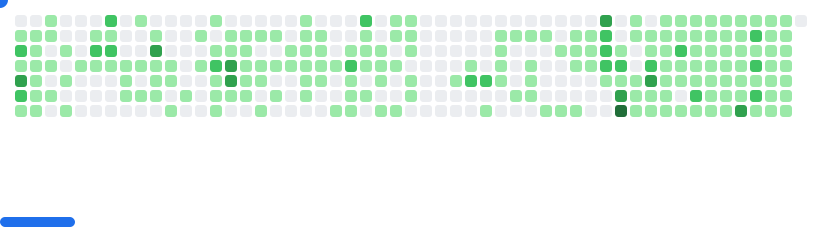

<h1 align="center">Varun Verma</h1>
<h3 align="center">Senior Backend & Cloud Engineer</h3>

Designing scalable systems • Cloud-native architectures • API-first platforms

  👀 

---

## 🧠 Professional Summary

Senior Lead Backend & Cloud Engineer with strong experience in **designing, building, and scaling distributed systems**.  
I focus on **clean architecture, performance, security, and observability** while staying tech-agnostic.

- ☁️ Cloud-native solutions on **Azure & AWS**
- 🏗️ Backend-heavy full-stack engineering
- 🔐 Auth, identity, secure APIs & system integrations
- 📈 Scalable, fault-tolerant, production-grade systems
- 🧩 Strong system design & architecture mindset

---

## ⭐ Featured Projects

### 🔐 Identity Provider & Authentication Platform
**Tech:** ASP.NET Core • OAuth2 • OpenID Connect • SAML • React  
- Built a custom **Identity Provider (IDP)** supporting OAuth2 & SAML
- Integrated with multiple service providers
- Secure token lifecycle, refresh flow, claims-based access

---

### 🎥 Secure Video Streaming Platform (YouTube-like)
**Tech:** React • Next.js • ASP.NET Core • Blob Streaming  
- Video streaming without exposing direct URLs
- Zero full-download buffering
- Blob-based playback with access control

---

### 📦 Large File Upload & Streaming System (5GB+)
**Tech:** React • Fetch Streams • Next.js API • ASP.NET Core  
- Chunked streaming uploads using `fetch`
- Real-time progress tracking
- Backend forwarding without temp storage

---

### ☁️ Cloud Infrastructure Automation
**Tech:** Terraform • Azure • Kubernetes  
- Conditional App Service provisioning
- Environment-aware infra modules
- Helm-based deployment pipelines

---

## 📌 Architecture & System Design Highlights

- **Clean Architecture / Hexagonal Architecture**
- **API Gateway + Auth Server pattern**
- **Stateless backend services**
- **Horizontal scaling & load balancing**
- **Async processing & message-driven design**
- **Observability-first systems (logs, metrics, tracing)**

> I design systems to **scale teams and traffic**, not just code.

---

## 🧰 Tech Stack (Expanded & Structured)

### Backend & Languages

### Cloud & DevOps

### Frontend

### Databases & Messaging

### Tooling & Quality

---

## 🎮 My GitHub Commit Heats (Original)

  <picture>
    <source media="(prefers-color-scheme: dark)" srcset="images/breakout-dark.svg" />
    <source media="(prefers-color-scheme: light)" srcset="images/breakout-light.svg" />
    
  </picture>

---

## 📊 GitHub Analytics

  
  

---

## 🏆 Achievements

  

---

## 🤝 Connect

  

